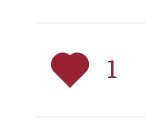

# Ghost Applause Button

A lightweight, privacy-focused applause/like system for Ghost blogs. Members can toggle their appreciation for posts with a beautiful animated heart button.



## ✨ Features

- 🎯 **One-click toggle** - Members can like/unlike posts
- 🔐 **Ghost native auth** - Uses Ghost's built-in member authentication
- 💾 **Lightweight** - SQLite database, ~128MB RAM usage
- 🔒 **Privacy-focused** - Only stores email hashes, no tracking
- ⚡ **Fast** - Optimistic UI with instant feedback

## 📋 Requirements

- Ghost 6.0+
- Docker Compose
- Reverse proxy (Caddy)
- Ghost members feature enabled

## 🚀 Quick Start

### 1. Clone and Configure

```bash
git clone https://github.com/yourusername/ghost-applause-button.git
cd ghost-applause-button

# Copy example files
cp .env.example .env
cp compose.example.yml compose.yml

# Edit .env with your Ghost URL
nano .env
```

### 2. Set Up the API

```bash
# Update compose.yml with your Ghost network name
# Find it with: docker network ls | grep ghost

cd applause-api
docker compose up -d
```

### 3. Configure Reverse Proxy

#### Caddy Configuration

```Caddyfile
yourdomain.com {
    # Your existing Ghost config...

    handle_path /applause/* {
        reverse_proxy ghost-applause:8787
    }
}
```

### 4. Install Theme Integration

See ghost-theme-integration/README.md for detailed theme installation.

## 📁 Project Structure

- /applause-api - Backend API server
- /ghost-theme-integration - Theme files and integration guide

## 🔒 Security

- JWTs are validated but not cryptographically verified (trusted source)
- Rate limiting: 90 requests/minute per IP
- CORS restricted to your Ghost domain
- No personal data stored except email (for deduplication)

## 📝 License

MIT License - See LICENSE file

## 🤝 Contributing

Contributions welcome!

## 💬 Support

- Open an issue
- Discussions
